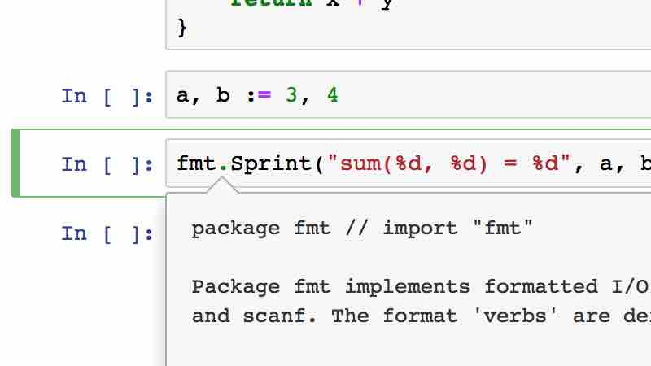
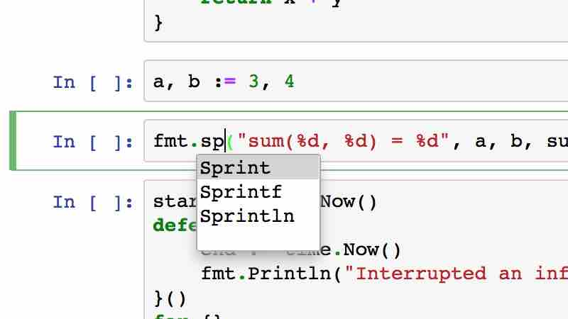

# lgo
[](https://mybinder.org/v2/gh/yunabe/lgo-binder/master?filepath=basics.ipynb)

Go (golang) Jupyter Notebook kernel and an interactive REPL

# Features
- Write and execute Go (golang) interactively like Python.
- Jupyter Notebook integration
- Full Go (golang) language spec support. 100% gc (go compiler) compatible.
- Code completion and inspection in Jupyter Notebooks
- Display images, HTML, JavaScript, SVG, etc...
- Currently, lgo is only supported on Linux. But you can use lgo on Mac and Windows with virtual machines or Docker.


# Jupyter notebook examples
You can view example notebooks of lgo from
[Example notebooks on Jupyter nbviewer](https://nbviewer.jupyter.org/github/yunabe/lgo/blob/master/examples/basics.ipynb)

If you want to execute these notebooks, you can try these notebooks on your browser without installation from [](https://mybinder.org/v2/gh/yunabe/lgo-binder/master?filepath=basics.ipynb)

# Try lgo from your browser without installation
[](https://mybinder.org/v2/gh/yunabe/lgo-binder/master?filepath=basics.ipynb)

Thanks to [binder (mybinder.org)](https://mybinder.org/), you can try lgo on your browsers with temporary docker containers on binder.
Open your temporary Jupyter Notebook from the button above and enjoy lgo.

# Quick Start with Docker
1. Install [Docker](https://docs.docker.com/engine/installation/) and [Docker Compose](https://docs.docker.com/compose/).
2. Clone the respository and run the docker container with docker-compose.
```
> git clone https://github.com/yunabe/lgo.git
> cd lgo/docker/jupyter
> docker-compose up -d
```
3. Check the name of the container started with `docker-compose` (e.g. `jupyter_jupyter_1`).
4. Get the URL to open the Jupyter Notebook
```
> docker exec jupyter_jupyter_1 jupyter notebook list
Currently running servers:
http://0.0.0.0:8888/?token=50dfee7e328bf86e70c234a2f06021e1df63a19641c86676 :: /examples
```
5. Open the Jupyter Notebook server with the authentication token above.

# Install
## Prerequisites
- lgo is supported only on Linux at this moment. On Windows or Mac OS, use virtual machines or dockers.
- [Install Go 1.9 or Go 1.8](https://golang.org/doc/install)
- Install [Jupyter Notebook](http://jupyter.readthedocs.io/en/latest/install.html)
- [Install ZMQ](http://zeromq.org/distro:debian)
  - e.g. `sudo apt-get install libzmq3-dev`

## Install
- `go get github.com/yunabe/lgo/cmd/lgo && go get -d github.com/yunabe/lgo/cmd/lgo-internal`
  - This installs `lgo` command into your `$GOPATH/bin`
- Set `LGOPATH` environment variable
  - `lgo install` will install binaries into the directory specified with `LGOPATH`.
  - You can use any empty directory with write permission as `LGOPATH`.
- Run `lgo install`
  - This installs libraries in your `$GOPATH/src` to `LGOPATH` with specific compiler flags.
  - It takes long time to install libraries if there are a lot libraries in your `GOPATH`.
  - If `lgo install` fails, please check install log stored in `$LGOPATH/install.log`
  - If `lgo install` fails because some packages can not be built, use blacklist those packages with `-package_blacklist` flag.
- Install the kernel configuration to Jupyter Notebook
  - `$GOPATH/src/github.com/yunabe/lgo/bin/install_kernel`

## Usage: Jupyter Notebook
- Run `jupyter notebook` command to start Juyputer Notebook and select "Go (lgo)" from New Notebook menu.
- To show documents of packages, functions and variables in your code, move the cursor to the identifier you want to inspect and press `Shift-Tab`.
- Press `Tab` to complete code
- lgo works with [JupyterLab](https://github.com/jupyterlab/jupyterlab). To use lgo from JupyterLab, install JupyterLab and run `jupyter lab`.




## Usage: REPL console
You can use lgo from command line with [Jupyter Console](https://github.com/jupyter/jupyter_console) or build-in REPL mode of lgo

### Jupyter Console (Recommended)
Run `jupyter console --kernel lgo`

```go
In [1]: a, b := 3, 4

In [2]: func sum(x, y int) int {
      :     return x + y
      :     }

In [3]: import "fmt"

In [4]: fmt.Sprintf("sum(%d, %d) = %d", a, b, sum(a, b))
sum(3, 4) = 7
```

### built-in REPL mode
Run `lgo run`

```go
$ lgo run
>>> a, b := 3, 4
>>> func sum(x, y int) int {
...     return x + y
...     }
>>> import "fmt"
>>> fmt.Sprintf("sum(%d, %d) = %d", a, b, sum(a, b))
sum(3, 4) = 7
```

# Tips
## go get and lgo
The packages you want to use in lgo must be prebuilt and installed into `$LGOPATH` by `lgo install` command.
Please make sure to run `lgo install` after you fetch a new package with `go get` command.

## Display HTML and images
To display HTML and images in lgo, use [`_ctx.Display`](https://godoc.org/github.com/yunabe/lgo/core#LgoContext).
See [the example of `_ctx.Display`](http://nbviewer.jupyter.org/github/yunabe/lgo/blob/master/examples/basics.ipynb#Display) in an example notebook

## Cancellation
In lgo, you can interrupt execution by pressing "Stop" button (or pressing `I, I`) in Jupyter Notebook and pressing `Ctrl-C` in the interactive shell.

However, as you may know, Go does not allow you to cancel running goroutines with `Ctrl-C`. Go does not provide any API to cancel specific goroutines. The standard way to handle cancellation in Go today is to use [`context.Context`](https://golang.org/pkg/context/#Context) (Read [Go Concurrency Patterns: Context](https://blog.golang.org/context) if you are not familiar with context.Context in Go).

lgo creates a special context `_ctx` on every execution and `_ctx` is cancelled when the execution is cancelled. Please pass `_ctx` as a context.Context param of Go libraries you want to cancel. Here is [an example notebook of cancellation in lgo](http://nbviewer.jupyter.org/github/yunabe/lgo/blob/master/examples/interrupt.ipynb).

## Memory Management
In lgo, memory is managed by the garbage collector of Go. Memory not referenced from any variables or goroutines is collected and released automatically.

One caveat of memory management in lgo is that memory referenced from global variables are not released automatically when the global variables are shadowed by other global variables with the same names. For example, if you run the following code blocks, the 32MB RAM reserved in `[1]` is not released after executing `[2]` and `[3]` because

- `[2]` does not reset the value of `b` in `[1]`. It just defines another global variable `b` with the same name and shadows the reference to the first `b`.
- `[3]` resets `b` defined in `[2]`. The memory reserved in `[2]` will be released after `[3]`. But the memory reserved in `[1]` will not be released.

```
[1]
// Assign 32MB ram to b.
b := make([]byte, 1 << 25)
[2]
// This shadows the first b.
b := make([]byte, 1 << 24)
[3]
// This sets nil to the second b.
b = nil
```

# Comparisons with similar projects
## gore
[gore](https://github.com/motemen/gore), which was released in Feb 2015, is the most famous REPL implementation for Go as of Dec 2017. gore is a great tool to try out very short code snippets in REPL style.

But gore does not fit to data science or heavy data processing at all.
gore executes your inputs by concatinating all of your inputs,
wrapping it with `main` function and running it with `go run` command.
This means every time you input your code, gore executes all your inputs from the begining.
For example, if you are writing something like

1. Loads a very large CSV file as an input. It takes 1 min to load.
2. Analyzes the loaded data. For example, calculates max, min, avg, etc..

gore always runs the first step when you calculate something and you need to wait for 1 min every time.
This behavior is not acceptable for real data science works. Also, gore is not good at tyring code with side effects (even fmt.Println) because code snippets with side effects are executed repeatedly and repeatedly.
lgo chose a totally different approach to execute Go code interactively and does not have the same shortcoming.

gore is a CLI tool and it does not support Jupyter Notebook.

## gophernotes
||lgo|gophernotes|
|:---|:---|:---|
|Backend|gc (go compiler)|An unofficial interpreter|
|Full Go Language Specs|:heavy_check_mark:||
|100% gc compatible|:heavy_check_mark:||
|Type Safety|:heavy_check_mark:||
|Performance|Fast|Slow|
|Overhead|500ms|1ms|
|[Cancellation](https://github.com/yunabe/lgo/blob/master/README.md#cancellation)|:heavy_check_mark:||
|Code completion|:heavy_check_mark:||
|Code inspection|:heavy_check_mark:||
|[Display HTML and images](https://github.com/yunabe/lgo/blob/master/README.md#display-html-and-images)|:heavy_check_mark:||
|Windows, Mac|Use Docker or VM|Partial|
|License|BSD|LGPL|

[gophernotes](https://github.com/gopherdata/gophernotes) is the first Jupyter kernel for Go, released in Jan 2016.
Before [Sep 2017](https://github.com/gopherdata/gophernotes/commit/69792d8af799d6905e2c576164d1a189ac021784#diff-04c6e90faac2675aa89e2176d2eec7d8), it used the same technology gore uses to evaluate Go code. This means it did not fit to heavy data processing or data analysis at all.
From Sep 2017, gophernotes switched from `go run` approach to [gomacro](https://github.com/cosmos72/gomacro), one of unofficial golang interpreters by [cosmos72](https://github.com/cosmos72). This solved the problem gore has. Now, gophernotes is a great tool for data science in Go.

The shortcomings of using an unofficial interpreter are
- It does not support all Go language features. Especially, it does not support one of the most important Go feature, `interface`.
  As of go1.10, it is hard to support `interface` in an interpreter written in Go because of the lack of API in `reflect` package.
- Interpreters are generally slow.
- Type unsafe. At least, gomacro is not statically typed.
- Unofficial interpreters are not well-tested compared to the official gc (go compiler) tools.

The advantages of this approach are
- The overhead of code execution is small because it does not compile and link code.
- Windows/Mac partial support. lgo works only on Linux and you need to use VMs or Docker to run it on Windows/Mac.
  gophernotes (gomacro) works on Windows/Mac natively [if you do not need third-party packages](https://github.com/gopherdata/gophernotes#limitations).

These disadvantage and advantages are not something inevitable in interperters. But they are not easy to solve under the limited development resource.

Also, lgo kernel supports more rich features in Jupyter Notebook as of Dec 2017, including code completion, code inspection and images/HTML/JavaScript output supports.

# Troubleshooting
## old export format no longer supported
### Symptom
Got error messages like:

```
could not import github.com/yunabe/mylib (/home/yunabe/local/gocode/pkg/linux_amd64/github.com/yunabe/mylib.a: import "github.com/yunabe/mylib": old export format no longer supported (recompile library))
```

### Reason and Solution
Some libraries installed in your `$GOPATH` are in the old format, which are built go1.6 or before.
Make sure all libraries under your `$GOPATH` are recompiled with your current go compiler.

```
cd $GOPATH/src; go install ./...
```
